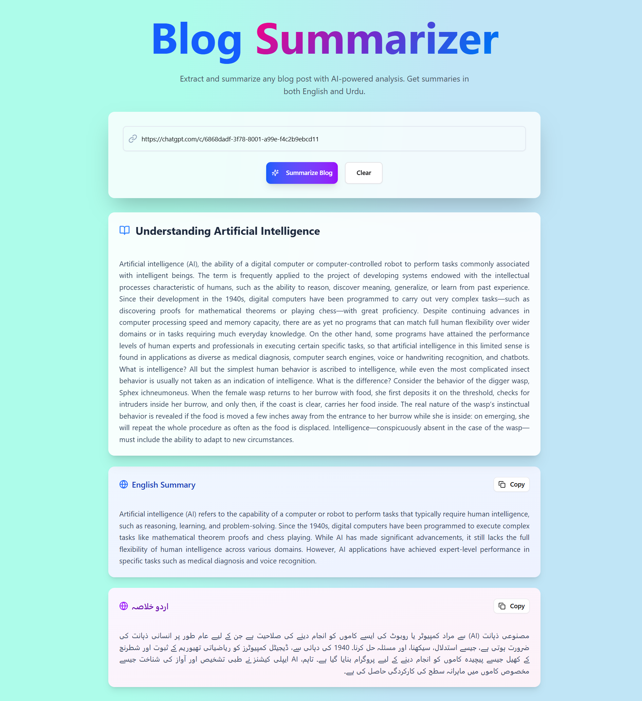

# 📰 Blog Summarizer

Blog Summarizer is a full-stack web application built using **Next.js 15**, designed to fetch and summarize blog content from any URL. It simulates AI-powered summarization and translates the summary into **Urdu**. The summaries are saved to **Supabase (PostgreSQL)**, while the full blog content is stored in **MongoDB Atlas** for scalable data storage.

## ✨ Features

- 🔗 Accepts any public blog URL.
- 🧠 Simulated AI-based blog summarization.
- 🌐 Auto-translates summary to Urdu.
- 📥 Stores summaries in **Supabase** and full content in **MongoDB**.
- 📦 Clean API handling with modern async/await syntax.
- 💻 Fully responsive and accessible UI using **ShadCN** and **Tailwind CSS**.

---

## 🔧 Tech Stack

| Tech          | Usage                         |
|---------------|-------------------------------|
| **Next.js 15** | App routing, API routes       |
| **TypeScript** | Type safety across the project|
| **TailwindCSS** | Styling and responsiveness   |
| **ShadCN UI** | Pre-styled React components   |
| **Supabase**   | Relational data storage (PostgreSQL) |
| **MongoDB Atlas** | Non-relational full content storage |
| **Vercel**     | Deployment & CI/CD            |
| **VS Code**    | Development environment       |

---

## 📸 Screenshots

### Homepage

### MongoDB Atlas

### Supabase

---

## 🚀 Getting Started

### 1. Clone the Repository

git clone https://github.com/aliatherayyubi/blog-summarizer.git
cd blog-summarizer

### 3.Add Environment Variables

NEXT_PUBLIC_SUPABASE_URL=your_supabase_url
NEXT_PUBLIC_SUPABASE_ANON_KEY=your_anon_key
MONGODB_URL=your_mongodb_connection_string

📜 License

This project is licensed under the MIT License.